# Infosec Links

## Certificações

👉Certified Ethical Hacker - CEH - https://www.eccouncil.org/programs/certified-ethical-hacker-ceh/

- CEHv12 Practice Exam 1: https://lnkd.in/dVeQUwiw
- CEHv12 Practice Exam 2: https://lnkd.in/d5ShM5AZ
- CEHv12 Practice Exam 3: https://lnkd.in/da8nkDn5
- CEHv12 Practice Exam 4: https://lnkd.in/dbPbn4x8
- CEHv12 Practice Exam 5: https://lnkd.in/ddsQ6DnM
- CEHv12 Practice Exam 6: https://lnkd.in/dVHf_TjH
- CEHv12 Practice Exam 7: https://lnkd.in/dST4u_MX
- CEHv12 Practice Exam 8: https://lnkd.in/d9Nue9QP

👉CompTia Security+ - https://www.comptia.org/certifications/security

👉E-Learning Security - https://elearnsecurity.com/

👉ISACA Certification CISM , CISA - https://www.isaca.org/

👉ISC2 CISSP - https://www.isc2.org/Certifications/CISSP

- ISC2 CCSP Practice Exam 1: https://lnkd.in/dekjyfPa
- ISC2 CCSP Practice Exam 2: https://lnkd.in/dy5bp8FP
- ISC2 CCSP Practice Exam 3: https://lnkd.in/d_3txHnb
- ISC2 CCSP Practice Exam 4: https://lnkd.in/dRbCYydv
- ISC2 CCSP Practice Exam 5: https://lnkd.in/ddXJZMfZ
- ISC2 CCSP Practice Exam 6: https://lnkd.in/ddv4aJ6M
- ISC2 CCSP Practice Exam 7: https://lnkd.in/dJ_4KcuJ
- ISC2 CCSP Practice Exam 8: https://lnkd.in/dAv2x-Ef

👉ISC2 SSCP - https://www.isc2.org/Certifications/SSCP

- SSCP Practice Exam 1: https://lnkd.in/dUKdvsxD
- SSCP Practice Exam 2: https://lnkd.in/dvXAzPtH
- SSCP Practice Exam 3: https://lnkd.in/deJQCyzA
- SSCP Practice Exam 4: https://lnkd.in/dGcumayJ
- SSCP Practice Exam 5: https://lnkd.in/ddfSty77
- SSCP Practice Exam 6: https://lnkd.in/dqeDi6jJ
- SSCP Practice Exam 7: https://lnkd.in/drWV3DHg
- SSCP Practice Exam 8: https://lnkd.in/diCvQMUS

👉Offensive Security OSCP - https://www.offensive-security.com/pwk-oscp/

👉SANS Certification GIAC - https://www.sans.org/

👉Other Practice Exams You Might Be Interested In:

- Security+ SY0-701: https://lnkd.in/dc7NTdvd
- CISSP: https://lnkd.in/dK4YNCM2
- ISC2 CC: https://certpreps.com/CC
- CISM: https://lnkd.in/d9x3_Djr
- CISA: https://lnkd.in/d-8BccxW
- AWS CLF-C02: https://lnkd.in/dHd_Nxgi
- Azure Fundamentals (AZ-900): https://lnkd.in/d4Zm9r-N
- CYSA+: https://lnkd.in/dfcGKsPt
- CCNA: https://certpreps.com/ccna
- A+: https://lnkd.in/dWDV5prF

## Cursos

👉Architecture 1001: x86-64 Assembly - https://p.ost2.fyi/dashboard

👉Autopsy - https://www.autopsy.com/

👉AWS Trainning - https://www.aws.training/

👉Certificação Gitlab - https://about.gitlab.com/solutions/education/

👉Cisco CyberSecurity - https://www.netacad.com/

👉Coursera - https://www.coursera.org/promo/cloud-technology-free-courses

👉Curso Shell Julio Neves - https://s2.dicas-l.com.br/ead/login/index.php

👉CyberArk - https://training.cyberark.com/

👉CyberDefense Org - https://cyberdefenders.org/

👉CyberSecurity EDX - https://www.edx.org/new/course/introduction-to-cybersecurity

👉CyberTraining365 - https://www.cybertraining365.com/

👉Cybrary - https://www.cybrary.it/

👉Desec Security - https://desecsecurity.com/

👉Devops 4 Linux - https://4linux.com.br/

👉E-Learning Security - https://elearnsecurity.com/

👉Fortinet Education - https://training.fortinet.com/

👉HackerOne - https://www.hacker101.com/

👉HEIMDAL - https://cybersecuritycourse.co/

👉IBM - https://www.youracclaim.com/

👉ICSI - https://www.icsi.co.uk/enrollments

👉Ine - https://my.ine.com

👉Malware Unicorn - https://malwareunicorn.org/workshops/re101.html#0

👉Microsoft Learn - https://docs.microsoft.com/pt-br/learn/

👉Mitre Attack - https://attack.mitre.org/matrices/mobile/

👉Mitre Attack IQ - https://academy.attackiq.com/learn/dashboard

👉On Fiap - https://on.fiap.com.br/fiaplogin/index.php

👉Open Security - https://opensecuritytraining.info/Training.html

👉Palo Alto Education - https://www.paloaltonetworks.com/services/education

👉Pentestlab - https://pentesterlab.com/

👉Pluralsight - https://www.pluralsight.com/offer/2020/free-april-month

👉PortSwigger - https://portswigger.net/web-security

👉SoftBlue  Banco de Dados - https://www.softblue.com.br/

👉TI Exames ISO ISFS - https://www.tiexames.com.br/

👉TryHackme - https://tryhackme.com/

👉UDEMY - https://www.udemy.com/

👉Web Security Academy - https://portswigger.net/web-security/all-materials

👉NetSpi - https://www.netspi.com/training/

👉Pycus - https://academy.picussecurity.com/courses

## GITHUB

👉Purple Team - https://github.com/ch33r10/EnterprisePurpleTeaming

👉Relatorios Pentest - https://github.com/swisskyrepo/PayloadsAllTheThings

## Zine

👉PHRACK - http://www.phrack.org/

👉PoC||GTFO - https://www.alchemistowl.org/pocorgtfo/

👉VX-Underground - https://vx-underground.org/

## Bug Bounty & CTF

👉Capture The Flag - https://capturetheflag.com.br/

👉CTF-BR - https://ctf-br.org/

👉Hack The Box - https://www.hackthebox.eu/

👉Pentest Academy - https://www.pentesteracademy.com/

👉Pentest Lab - https://pentesterlab.com/

👉TryHackMe - https://tryhackme.com/

👉Vulnhub - https://www.vulnhub.com/

👉BugCrowd - https://www.bugcrowd.com/bug-bounty-list/

👉BugHunt - https://www.bughunt.com.br/

👉HackerOne - https://www.hackerone.com/internet-bug-bounty

👉CyberSec Labs - https://lnkd.in/eaxu3qAy

👉Lets Defend - https://letsdefend.io/

👉Root me - https://lnkd.in/ePCQKZMU

👉Blue Team Labs - https://lnkd.in/e3rPGaPS

👉Hacker101 - https://www.hacker101.com/

👉Cyberdefenders - https://lnkd.in/etvaU3cX

👉Overthewire - https://lnkd.in/egC9cbf4

👉 𝗟𝗘𝗔𝗥𝗡
🌟 An Introduction to Bug Bounty Hunting by Nicole Kow
https://lnkd.in/e4dhZ_6Z

🌟 How to get into bug bounty by Katie Paxton-Fear
https://lnkd.in/eEf6b5AN

🌟 How to get started with Bug Bounty Hunting by Daniel Kelley
https://lnkd.in/e6by-NVD

🌟 Practical Bug Bounty by TCM Security
https://lnkd.in/eSVB42yQ

🌟Bug Bounty Beginner Course by Ryan John
https://lnkd.in/eN3aBDmX

🌟 Bug bounty Beginner's Roadmap by Ansh Bhawnani
https://lnkd.in/e4kyTh72

🌟 my updated bug bounty resources by Farah Hawa
https://lnkd.in/ea-Nn2KB

🌟 The Bug Hunter Handbook by Gowthams
https://lnkd.in/eW6awYWU

🌟 “AllAboutBugBounty” by daffainfo
https://lnkd.in/evPuwGKZ

🌟 Smart Contract Bug Bounties: Beginner’s Guide To Web3 Bug Hunting by Hacken
https://lnkd.in/eTH8N79C

🌟 Bug Bounty Hunters Setups and Writeups by Joas A Santos
https://lnkd.in/eHcDP8xq

👉 𝗙𝗜𝗡𝗗 𝗣𝗥𝗢𝗚𝗥𝗔𝗠𝗦 𝗔𝗡𝗗 𝗣𝗟𝗔𝗧𝗙𝗢𝗥𝗠𝗦
🌟 A list of bug bounty platforms by disclose
https://lnkd.in/e27qdTkn

🌟 A list of bug bounty programs by vpnmentor:
https://lnkd.in/eECUuYgp

🌟 Bug bounty programs for smart contract by Consensys
https://lnkd.in/eBcuqGRg

👉 𝗩𝗔𝗥𝗜𝗢𝗨𝗦 𝗣𝗢𝗜𝗡𝗧 𝗢𝗙 𝗩𝗜𝗘𝗪𝗦
🌟 Critical Thinking - Bug Bounty Podcast by Justin Gardner
https://lnkd.in/eTYgZQ4W

## Active Directory

👉Vulnerable AD lab by WazeHell - https://lnkd.in/evJZM_yv

👉 Pentips C.S by G.B - https://lnkd.in/ez_vjgky

👉Cloud-Architekt - https://lnkd.in/eDb7JJAQ

👉Julien Provenzano - https://lnkd.in/ePgnhbUk

👉Active Directory Exploitation Cheat by Integration-IT - https://lnkd.in/eY2jD3nv

👉Set up and AD home lab with this blog post from spookysec: https://lnkd.in/eN8V88kv

👉You also have a script here to set up a Vulnerable AD lab by WazeHell
https://lnkd.in/evJZM_yv

👉 Check out the dedicated section on Active Directory of my Pentips C.S by G.B
https://lnkd.in/ez_vjgky

👉Here is a collection of various common attack scenarios on Azure Active Directory by Cloud-Architekt:
https://lnkd.in/eDb7JJAQ

👉Julien Provenzano ☁ shared a great document full of resources here:
https://lnkd.in/ePgnhbUk

👉Finally here is an Active Directory Exploitation Cheat Sheet by Integration-IT
https://lnkd.in/eY2jD3nv

## QRadar

👉Getting started with QRadar - https://lnkd.in/ga3rZvKe

👉QRadar Fundamentals - https://lnkd.in/guVawsUP

👉QRadar SIEM Administrator - https://lnkd.in/gx3V9zQw

👉QRadar SIEM Analyst - https://lnkd.in/g2SDMN5f

👉Managed Security Service Providers (MSSP) - https://lnkd.in/gYbJ_3GQ

👉For all course catalog - https://lnkd.in/gb8TquQD

## Rust Language for Offensive Security

👉Writing Offensive Tools in Rust by Antisyphon - https://lnkd.in/dt2GiqFF

👉Why Rust or Offensive Rust by memn0ps - https://lnkd.in/d6KsWZi3

👉Offensive Notion by mttaggart - https://lnkd.in/duea8bm3

👉Awesome Rust Security by osirislab - https://lnkd.in/dF_DWY4r

👉Rust RedOps by joaoviictorti - https://lnkd.in/d9EydTnv

👉Offensive Rust by winsecurity - https://lnkd.in/d_gD2EDh

👉Offensive Rust 2 by trickster0 - https://lnkd.in/dBF4kDzz

## Security Docs

👉𝗡𝗜𝗦𝗧 𝗔𝗜 𝗥𝗶𝘀𝗸 𝗠𝗮𝗻𝗮𝗴𝗲𝗺𝗲𝗻𝘁 𝗙𝗿𝗮𝗺𝗲𝘄𝗼𝗿𝗸 - https://lnkd.in/eMXCgUv3

👉𝗡𝗜𝗦𝗧 𝟴𝟬𝟬-𝟯𝟬 - https://lnkd.in/gWTm3mxG

👉𝗖𝗜𝗦 𝗥𝗔𝗠 - 𝗥𝗶𝘀𝗸 𝗔𝘀𝘀𝗲𝘀𝘀𝗺𝗲𝗻𝘁 𝗠𝗲𝘁𝗵𝗼𝗱 - https://lnkd.in/grxJE3vw

👉𝗙𝗮𝗶𝗿 𝗜𝗻𝘀𝘁𝗶𝘁𝘂𝘁𝗲 - https://lnkd.in/g8AwNaCK

👉𝗛𝗜𝗣𝗔𝗔 𝗥𝗶𝘀𝗸 𝗔𝗻𝗮𝗹𝘆𝘀𝗶𝘀 - https://lnkd.in/gxfN7-rc

👉𝗜𝗦𝗔𝗖𝗔 𝗚𝘂𝗶𝗱𝗮𝗻𝗰𝗲 𝗼𝗻 𝗥𝗶𝘀𝗸 𝗔𝘀𝘀𝗲𝘀𝘀𝗺𝗲𝗻𝘁𝘀 - https://lnkd.in/g5kMF2mE

👉𝗣𝗖𝗜 𝗗𝗦𝗦 𝗚𝘂𝗶𝗱𝗮𝗻𝗰𝗲 𝗼𝗻 𝗥𝗶𝘀𝗸 𝗔𝘀𝘀𝗲𝘀𝘀𝗺𝗲𝗻𝘁 - https://lnkd.in/gYnqBERW

👉𝗛𝗲𝗮𝗹𝘁𝗵 𝗜𝗧 𝗦𝗲𝗰𝘂𝗿𝗶𝘁𝘆 𝗥𝗶𝘀𝗸 𝗔𝘀𝘀𝗲𝘀𝘀𝗺𝗲𝗻𝘁 𝗧𝗼𝗼𝗹 - https://lnkd.in/g5eSnvuH

👉𝗖𝗹𝗼𝘂𝗱 𝗦𝗲𝗰𝘂𝗿𝗶𝘁𝘆 𝗔𝗹𝗹𝗶𝗮𝗻𝗰𝗲 𝗢𝗰𝘁𝗮𝗴𝗼𝗻 𝗠𝗼𝗱𝗲𝗹 - https://lnkd.in/gRSxDKHp

👉𝗔𝗪𝗦, 𝗚𝗖𝗣, 𝗔𝘇𝘂𝗿𝗲 𝗚𝘂𝗶𝗱𝗮𝗻𝗰𝗲 𝗼𝗻 𝗥𝗶𝘀𝗸 𝗔𝘀𝘀𝗲𝘀𝘀𝗺𝗲𝗻𝘁𝘀

- AWS - https://lnkd.in/gf5RDv2i

- GCP - https://lnkd.in/ggcVJz56

- Azure - https://lnkd.in/gv73Uz9F

👉F𝘂𝗹𝗹𝗖𝗶𝗿𝗰𝗹𝗲 𝗚𝗥𝗖 𝗥𝗶𝘀𝗸 𝗥𝗲𝗴𝗶𝘀𝘁𝗲𝗿 - https://lnkd.in/gfywxZab

## ⚡ FREE SIEM TRAININGS 2024 ⚡

### General

👉Windows Logging Basics - https://lnkd.in/grKYFQzJ

👉Jose Bravo - What is a SIEM? (5 Vídeos) - https://lnkd.in/gc2UDpeD

👉PowerSIEM Analyzing Sysmon Events with

👉PowerShell - https://lnkd.in/g_8Eq8vm

### Splunk

👉Course Catalog - https://lnkd.in/ekm6RekE

👉Basic Searching - https://lnkd.in/gygnTMfD

👉Practical Splunk - Zero to Hero - https://lnkd.in/ePF_3PWj

👉Splunk Use Cases - https://lnkd.in/eJ4CTNV2

👉Exploring Splunk - https://lnkd.in/e8gVvMuu

### QRadar

👉Jose Bravo - QRadar (38 Vídeos): https://lnkd.in/gd7V_4pe

👉QRadar 101 - https://lnkd.in/esbz2RjK

👉QRadar SIEM Foundation - https://lnkd.in/es8NAdAw

👉Ariel Query Language Guide - https://lnkd.in/eAMKy25q

### Microsoft Sentinel

👉What is Microsoft Sentinel - https://lnkd.in/gdB7dAdU

👉Microsoft Sentinel Level 400 training - https://lnkd.in/ezDkpWmx

👉SOC 101 - https://lnkd.in/evnF6kNm

### Fortinet

👉FortiSIEM - https://lnkd.in/e5TvYZYt

### AlienVault OSSIM

👉Cybrary - AlienVault OSSIM: https://lnkd.in/gRZAansT

### Elastic - SIEM

👉Fundamentals: https://lnkd.in/gYNYs9vS

### ArcSight (2 séries/paylists de vídeos)

👉Paul Brettle - What is Series: https://lnkd.in/gh5ruPZt

👉Paul Brettle - ArcSight ESM 101: https://lnkd.in/gS33AJdk

👉ArcSight Tutorial - https://lnkd.in/guEydy_U

### SureLogSIEM Training

👉Training (English) - https://lnkd.in/eAnAYDWJ

👉Training (Turkish) - https://lnkd.in/e9VgJFHa

👉Training PDF - https://lnkd.in/eXYFmqqV

👉User Guide PDF - https://lnkd.in/e4HqkexW

## Escalação de Privilegios

👉 𝗪𝗵𝗮𝘁 𝗶𝘀 𝗣𝗿𝗶𝘃𝗶𝗹𝗲𝗴𝗲 𝗘𝘀𝗰𝗮𝗹𝗮𝘁𝗶𝗼𝗻?
🌟 Cybersecurity 101 - What is Privilege escalation on CrowdStrike 
https://lnkd.in/e4diwQrf

🌟 Privilege Escalation Attack and defend explained on BeyondTrust
https://lnkd.in/enQ-AMhB

👉 𝗪𝗶𝗻𝗱𝗼𝘄𝘀 𝗣𝗿𝗶𝘃𝗶𝗹𝗲𝗴𝗲 𝗘𝘀𝗰𝗮𝗹𝗮𝘁𝗶𝗼𝗻
🌟 My Pentips on Windows Privilege escalation on CSbyGB - Pentips
https://lnkd.in/eXgR_Eua

🌟 Windows Privilege Escalation on PayloadsAllTheThings
https://lnkd.in/e7rGg5MF

🌟 Windows Privesc guide on absolomb’s security blog
https://lnkd.in/eBfktNes

🌟 Windows Local Privilege Escalation checklist on HackTricks
https://lnkd.in/eJqFJy8n

👉 𝗟𝗶𝗻𝘂𝘅 𝗣𝗿𝗶𝘃𝗶𝗹𝗲𝗴𝗲 𝗘𝘀𝗰𝗮𝗹𝗮𝘁𝗶𝗼𝗻
🌟 My Pentips on Linux Privilege Escalation on CSbyGB - Pentips
https://lnkd.in/ekx-xdfm

🌟 Linux Privilege Escalation on PayloadsAllTheThings
https://lnkd.in/ePmZSw6t

🌟 Basic Linux Privilege Escalation on g0tm1lk’s blog
https://lnkd.in/e7dCUQXM

🌟 Guide Linux Privilege Escalation on Payatu
https://lnkd.in/eMD3JRbE

🌟 A curated list of Unix Binaries to bypass local security restrictions by GTFOBins
https://lnkd.in/eucjKtCP

🌟 Linux Privilege Escalation Checklist on HackTricks
https://lnkd.in/ef_wgGex

## Bypass

### Bypass using Msfvenom

- https://lnkd.in/dAsVuCwp

- https://lnkd.in/d3rJPZDC

### Bypass using Alternative Tools

- https://lnkd.in/e2p42bvZ - EXOCET

- https://lnkd.in/dUxb35DA - SharpSploit

- https://lnkd.in/ddYxZHae - Veil Evasion

- https://lnkd.in/dcErruRU - peCloak

- https://lnkd.in/dhQrBBvX - SharpShooter

- https://lnkd.in/dQZvb5TQ - Donut

- https://lnkd.in/dUhRkDSZ - Vulcan

- https://lnkd.in/dBt25V38 - OffensivNim

- https://lnkd.in/eVZrPGF - AvLator

- https://lnkd.in/dg5UTDzx - AtomPePacker

### Bypass using Powershell

- https://lnkd.in/dQ98cqnY

- https://lnkd.in/d-Xsu6Fh - PyFuscation

- https://lnkd.in/dgjjAqsm - Invoke Obfuscation

- https://lnkd.in/d4VigsJy - Bypass the Powershell Execution Policy

- https://lnkd.in/dA4jbk_B - Powersploit (Retired)

- https://lnkd.in/d9HC5R5C - AMSI Bypass Powershell

- https://lnkd.in/dbMCP5Jt - Bypass Scripts Powershell

### Bypass Techniques

- https://lnkd.in/djbHvS-7 - DLL Unhooking

- https://lnkd.in/dDpJi3r2

- https://lnkd.in/duzg5a_G

- https://lnkd.in/dRMk-SeR - DInvoke

- https://lnkd.in/dsVDAkFA - PeLoader

- https://lnkd.in/d7gKqgfp - Invoke ReflectivePEInjection

- https://lnkd.in/dA-uTcmK - HellsGate

- https://lnkd.in/dj_nQuZj - Antivirus Artifacts

- https://lnkd.in/dTgQqM58 DLL Proxying and Sideloading

- https://lnkd.in/dzVXBBtz - Reflection in C#

- https://lnkd.in/duH2dniY

- https://lnkd.in/dWQhY4KG

- https://lnkd.in/dzPbWihq

- https://lnkd.in/dZ_N_yYw

### Windows APIs

👉  https://lnkd.in/dvhuTBKz

👉  https://lnkd.in/dxZgXvBs

## SOC

👉 𝗦𝗞𝗜𝗟𝗟𝗦
🌟 Skills level 1 and level 2 by Sohail Patel
✅L1: https://lnkd.in/ehVKvr3n
✅L2: https://lnkd.in/eV54kdbZ

👉 𝗖𝗔𝗥𝗘𝗘𝗥
🌟Want a Cyber Career as a SOC Analyst by Mike Miller
https://lnkd.in/e-K2cnuR
 
🌟A Day in the life of SOC: Wicys Webinar Amina A.
https://lnkd.in/ekA-nuiM

🌟A TYPICAL Day in the LIFE - TechTual chatter
https://lnkd.in/ewZF6ZMW

🌟Before you work in a SOC, Watch This by 👉🏼 Gerald Auger, Ph.D. with Brandon Poole
https://lnkd.in/ewtBCAtA

👉 𝗦𝗧𝗨𝗗𝗬
🌟SOC Analyst study Guide by Jay Jay Davey
https://lnkd.in/eezmcAfX

🌟 SOC Analyst learning Path on letsdefend
https://lnkd.in/e3iPvP8y

🌟Security Operation Center [People] - Certs & Courses to SOC by Joas A Santos
https://lnkd.in/eJMvB_6y 

🌟SOC study and career Joas A Santos
https://lnkd.in/ewqnDv43

👉 𝗛𝗔𝗡𝗗𝗦 𝗢𝗡 - 𝗕𝗨𝗜𝗟𝗗 𝗔 𝗦𝗢𝗖
🌟World's Best SIEM Stack by Taylor Walton
https://lnkd.in/ePjbSP9A

🌟Low cost soc by Joas A Santos
https://lnkd.in/e-WtUxRb

🌟Build own SIEM tool with open source by SOCFortress
https://lnkd.in/eghABBmj

🌟The Cheapest Way to Become a Cybersecurity Pro: Get Your SOC Analyst Journey Started Now! - Gerald Auger
https://lnkd.in/eZmpZ2A4

🌟 Cybersecurity Playbook for SOC
https://lnkd.in/ebxdg5eD

👉𝗚𝗘𝗧 𝗥𝗘𝗔𝗗𝗬 𝗙𝗢𝗥 𝗧𝗛𝗘 𝗜𝗡𝗧𝗘𝗥𝗩𝗜𝗘𝗪
🌟 Interview Questions - Hackthebox
https://lnkd.in/efEug4xb

🌟SOC Analyst Interview questions - Let’s defend
https://lnkd.in/eSdqn-ub

🌟SOC Analyst interview Q&A Ken Underhill
https://lnkd.in/ekYTDYZj

🌟12 Incredible SOC Analyst Interview Q&A by Gerald Auger
https://lnkd.in/ei2PXakS

👉𝗥𝗘𝗦𝗢𝗨𝗥𝗖𝗘𝗦
🌟Awesome soc by cyb3rxp
https://lnkd.in/eTppaaRh

🌟Blue Team Resources SOC Analyst by Micah’s 0-day
https://lnkd.in/eFNQxjKn

## SOC 02

1. 𝗜𝗻𝘁𝗿𝗼𝗱𝘂𝗰𝘁𝗶𝗼𝗻 𝘁𝗼 𝗦𝗢𝗖 𝟮 (https://lnkd.in/gHjm5kdA)

Overview of SOC 2, the business case for achieving SOC 2, typical timeline, and who in your organization needs to be involved.

2. 𝗛𝗼𝘄 𝘁𝗼 𝗴𝗲𝘁 𝗿𝗲𝗮𝗱𝘆 𝗳𝗼𝗿 𝗮 𝗦𝗢𝗖 𝟮 𝗮𝘂𝗱𝗶𝘁 (https://lnkd.in/gAVdz8Rw)

This video covers what you need to do before, during, and after a SOC 2 audit to ensure your project is successful.

3. 𝗛𝗼𝘄 𝘁𝗼 𝗠𝗮𝗶𝗻𝘁𝗮𝗶𝗻 𝘆𝗼𝘂𝗿 𝗦𝗢𝗖 𝟮 𝗽𝗿𝗼𝗴𝗿𝗮𝗺 𝗯𝗲𝘁𝘄𝗲𝗲𝗻 𝗮𝘂𝗱𝗶𝘁𝘀 (https://lnkd.in/g9sF3NKP)

SOC 2 audits are an annual event. In this video, we cover tips on how to maintain your SOC 2 program between audits.

4. 𝗦𝗢𝗖 𝟮 𝗙𝗿𝗮𝗺𝗲𝘄𝗼𝗿𝗸 𝗢𝘃𝗲𝗿𝘃𝗶𝗲𝘄 (https://lnkd.in/gtXNqBeM)

This is an hour long video where we have the framework up on the screen and discuss every control - in plain English.

5. 𝗕𝘂𝘀𝗶𝗻𝗲𝘀𝘀 𝗖𝗮𝘀𝗲 𝗳𝗼𝗿 𝗦𝗢𝗖 𝟮 (https://lnkd.in/gG-tcAQH)

This whitepaper helps think through the business case for doing SOC 2. Reasons why you should do it and a few why you should wait.

This is a great thinking model as you consider if SOC 2 is a worthy pursuit.

6. 𝗙𝗿𝗲𝗲 𝗦𝗢𝗖 𝟮 𝗥𝗢𝗜 𝗖𝗮𝗹𝗰𝘂𝗹𝗮𝘁𝗼𝗿 (https://lnkd.in/gubusix2)

Excel ROI calculator if you are trying to make a business case for SOC 2.

7. 𝗦𝗢𝗖 𝟮 𝗕𝘂𝘀𝗶𝗻𝗲𝘀𝘀 𝗖𝗮𝘀𝗲 𝗣𝗿𝗲𝘀𝗲𝗻𝘁𝗮𝘁𝗶𝗼𝗻 (https://lnkd.in/gVXGpwWT)

Powerpoint presentation template you can use as a starting point to present a SOC 2 business case to your team.

## VMS Security

💿 Kali Purple (SOC-in-a-box):
https://lnkd.in/d63U2jst

💿 Kali Linux (Pentesting):
https://lnkd.in/dfvvCUeh

💿 Predator-OS (Pentesting):
https://predator-os.ir/

💿 BlackArch Linux (Pentesting):
https://lnkd.in/dQuQV4SK

💿 BackBox (Pentesting):
https://www.backbox.org/

💿 Kookarai (Pentesting):
https://lnkd.in/d-4ckJ97

💿 ParrotOS (Red and Blue Team operation):
https://parrotsec.org/

💿 Commando VM (Windows-based Pentesting/Red Teaming):
https://lnkd.in/dec8_V3B

💿 Whonix (Privacy and Anonymity): 
https://lnkd.in/dpWagU2f

💿 Tails (Privacy and Anonymity):
https://tails.net/

💿 Qubes OS (Hypervisor):
https://www.qubes-os.org/

💿 Mandiant Threat Pursuit (Windows-based Threat Intelligence and Hunting):
https://lnkd.in/d-N4Dt9x

💿 Tsurugi Linux (Digital Forensics and OSINT):
https://lnkd.in/dsr-ekeB

💿 SIFT Workstation (Digital Forensics):
https://lnkd.in/dmnZRNNP

💿 CSI Linux (Digital Forensics):
https://csilinux.com/

💿 CAINE (Digital Forensics):
https://lnkd.in/dYn9b7Hs

💿 RedHunt-OS Linux (Adversary Emulation and Threat Hunting):
https://lnkd.in/db5sd6h3

💿 FLARE-VM (Reverse Engineering):
https://lnkd.in/ds9s4Wdz

💿 REMnux (Reverse Engineering/Malware Analysis):
https://remnux.org/

💿 Trace Labs OSINT VM (OSINT to Find Missing Persons):
https://lnkd.in/dsymX2KG

💿 Security Onion (Threat Hunting, Network Security Monitoring, and Log Management):
https://lnkd.in/d4r6myav

## Roadmap

                                                                    
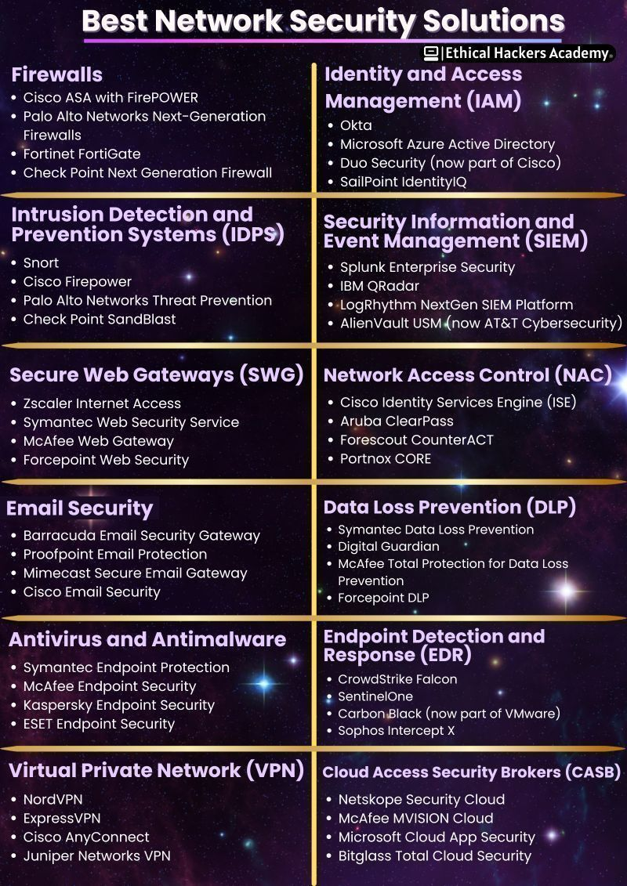 
                                                           
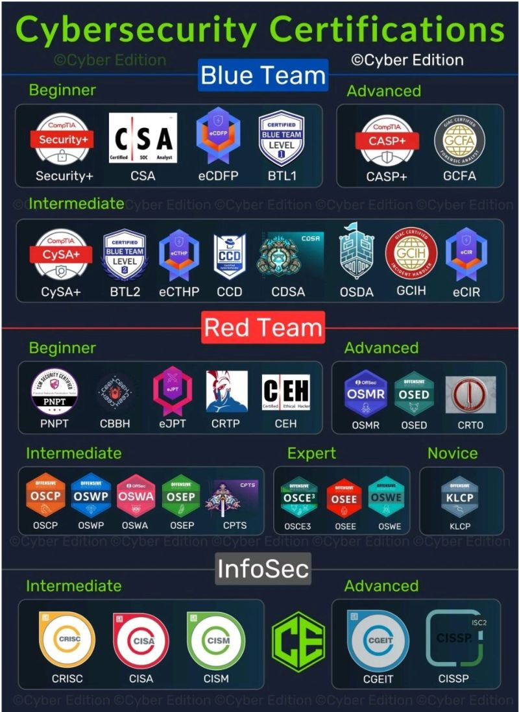 
                                                 
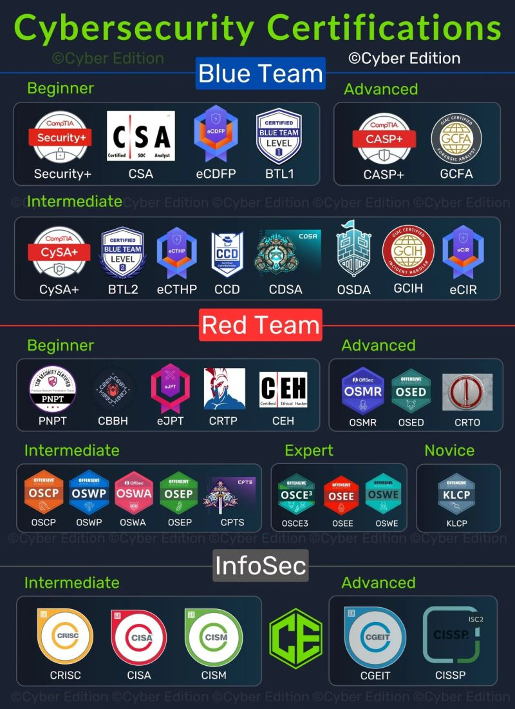
                                                 
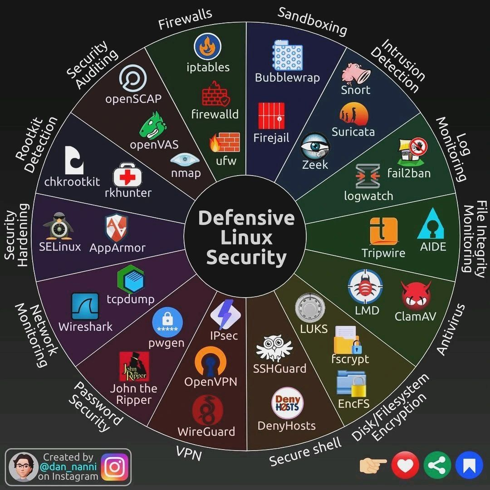
                                                                
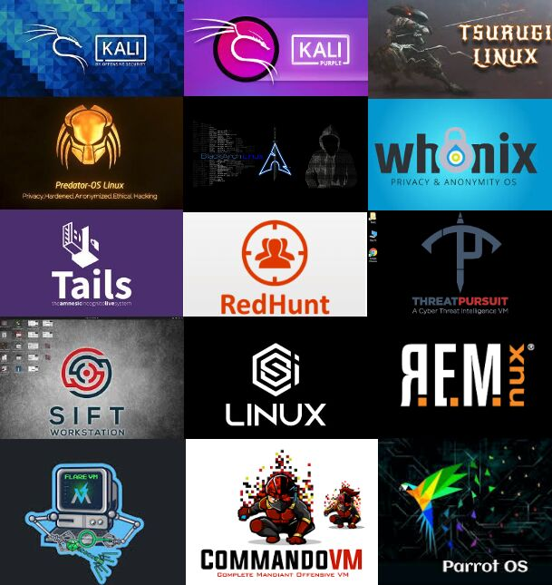
                                                                                                           
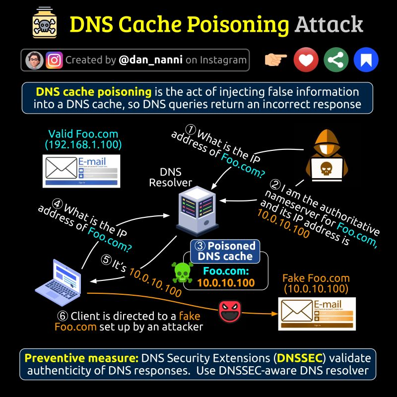
                                                                    
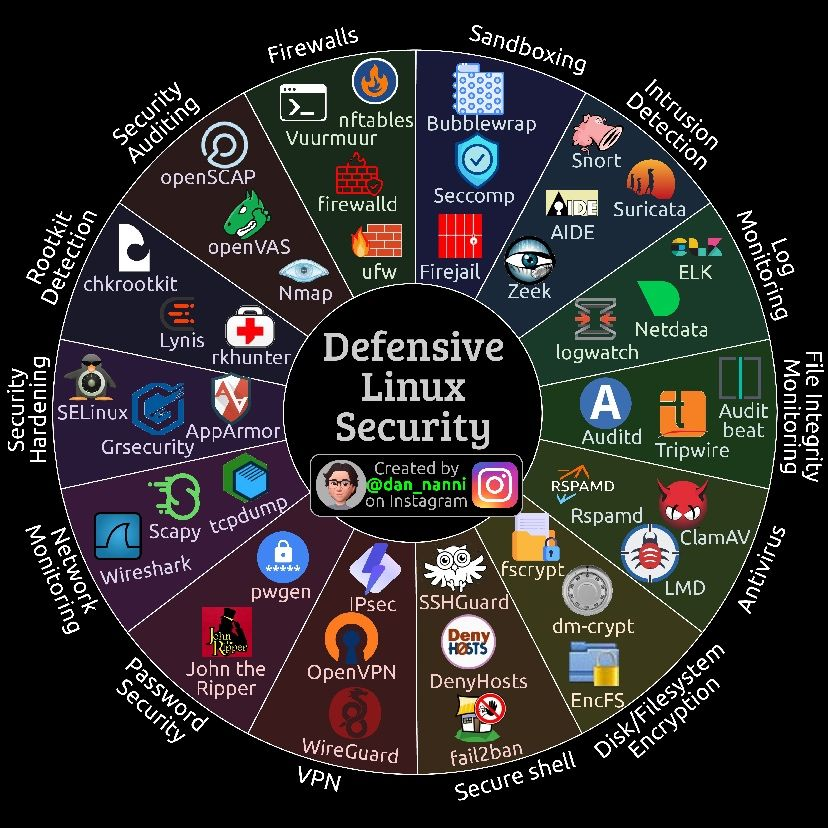 
                                                               
 
                                                         
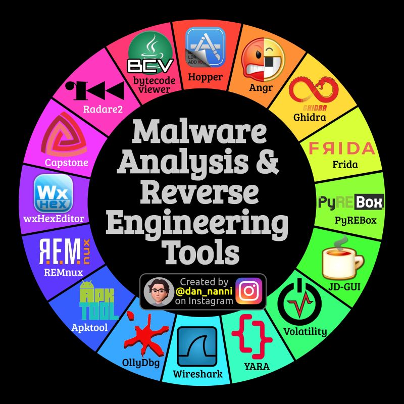 
                                                            
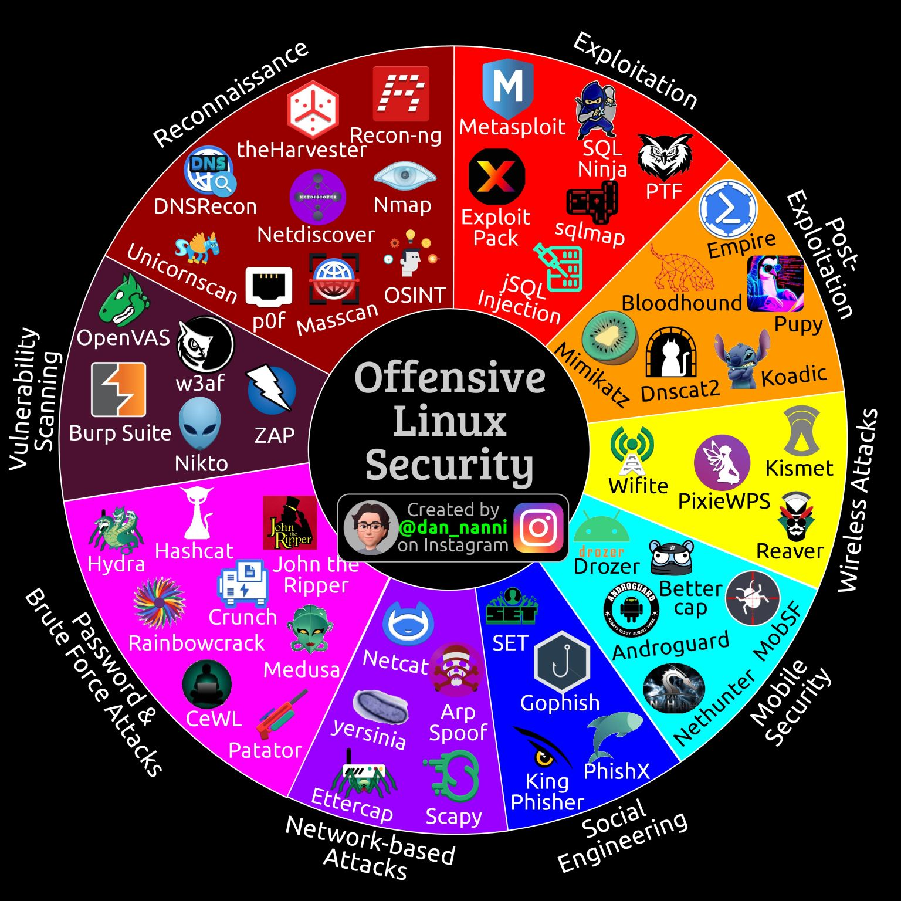
                                                      
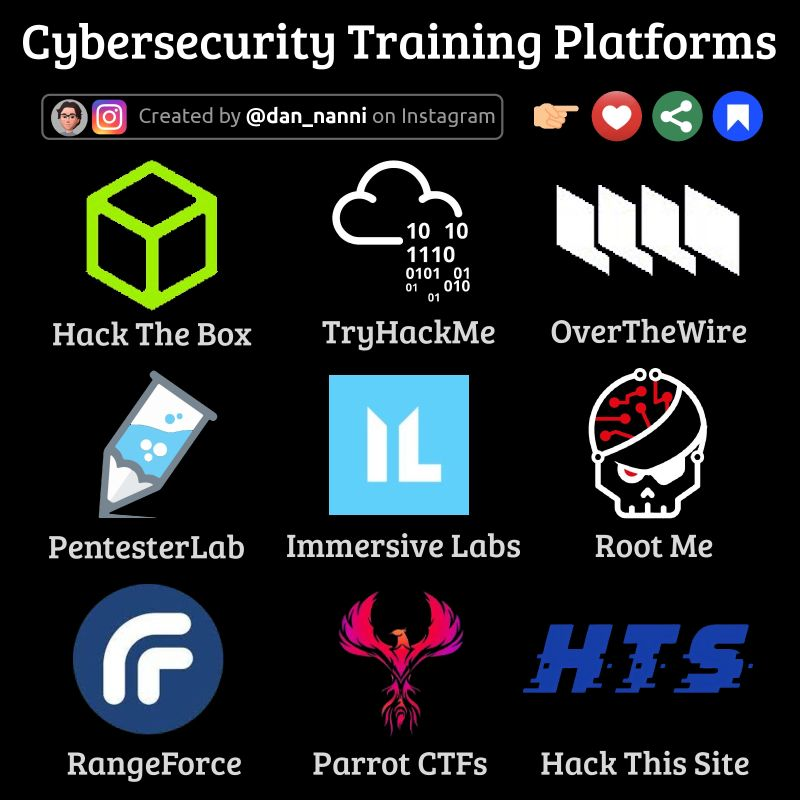
                                                                   
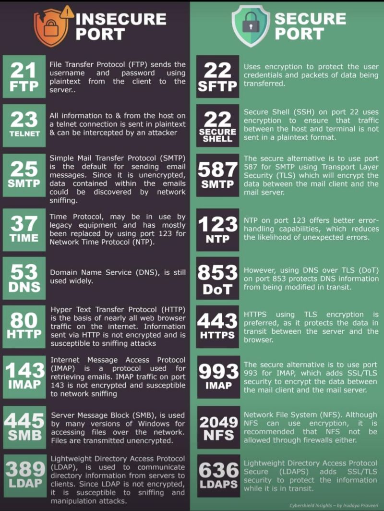 
                                                                                                                                 
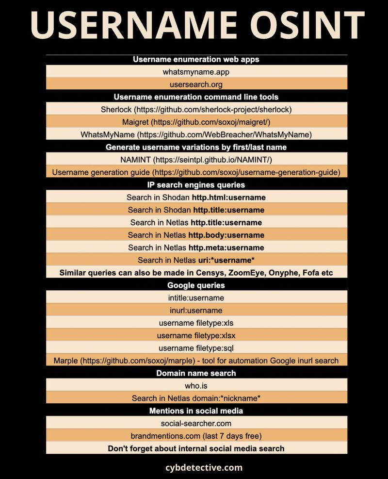

